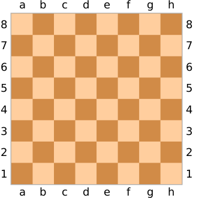
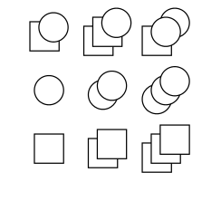
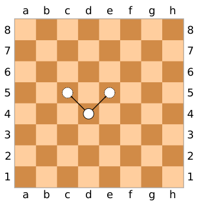
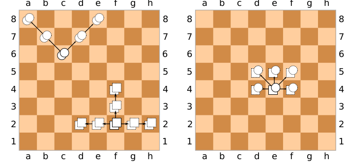

======Jeu du Gounki=========
============================

Ce jeu se joue a 2 dans un echequier 8X8 , 
 
chaque joueurs possede au debut des carrés et des ronds
le but du jeu est d'atteindre le bord adverse en premier pas une piecede son jeu.
Mais il existe des transformations ,en effet si un rond mangeun rond il deviens double rond avec des capacités plus impressionnante
 

 
encore.
Les deplacements sont : 

